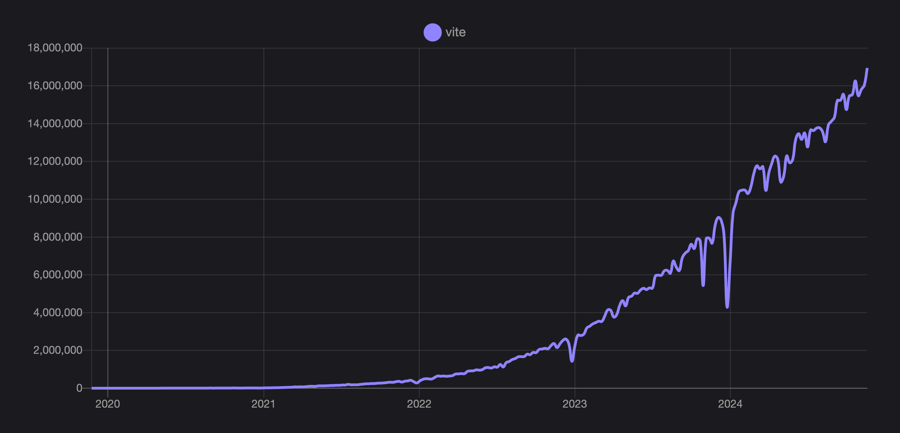

# ¡Vite 6.0 ya está disponible!

_26 de Noviembre de 2024_

Hoy damos otro gran paso en la historia de Vite. El equipo de Vite, los colaboradores y los socios del ecosistema están emocionados de anunciar el lanzamiento de Vite 6.

Ha sido un año lleno de eventos. La adopción de Vite sigue creciendo, con las descargas semanales de npm saltando de 7.5 millones a 17 millones desde el lanzamiento de Vite 5 hace un año. [Vitest](https://vitest.dev) no solo es más favorecido por los usuarios, sino que también está comenzando a formar su propio ecosistema. Por ejemplo, [Storybook](https://storybook.js.org) ahora tiene nuevas capacidades de prueba impulsadas por Vitest.

Nuevos frameworks también se han unido al ecosistema de Vite, incluyendo [TanStack Start](https://tanstack.com/start), [One](https://onestack.dev/), [Ember](https://emberjs.com/), entre otros. Los frameworks web están innovando a un ritmo cada vez más rápido. Puedes ver las mejoras que se están realizando en [Astro](https://astro.build/), [Nuxt](https://nuxt.com/), [SvelteKit](https://kit.svelte.dev/), [Solid Start](https://www.solidjs.com/blog/introducing-solidstart), [Qwik City](https://qwik.builder.io/qwikcity/overview/), [RedwoodJS](https://redwoodjs.com/), [React Router](https://reactrouter.com/), y la lista sigue.

Vite es utilizado por OpenAI, Google, Apple, Microsoft, NASA, Shopify, Cloudflare, GitLab, Reddit, Linear, entre muchos otros. Hace dos meses, comenzamos una lista de [empresas que usan Vite](https://github.com/vitejs/companies-using-vite). Nos alegra ver a muchos desarrolladores enviándonos un PR para agregar sus empresas a la lista. Es difícil de creer cuánto ha crecido el ecosistema que construimos juntos desde que Vite dio sus primeros pasos.

## Acelerando el ecosistema de Vite

El mes pasado, la comunidad se reunió para la tercera edición de [ViteConf](https://viteconf.org/24/replay), organizada una vez más por [StackBlitz](https://stackblitz.com). Fue la conferencia más grande de Vite, con una amplia representación de los creadores del ecosistema. Entre otros anuncios, Evan You presentó [VoidZero](https://staging.voidzero.dev/posts/announcing-voidzero-inc), una empresa dedicada a construir una cadena de herramientas de desarrollo unificada y de alto rendimiento para el ecosistema JavaScript. VoidZero está detrás de [Rolldown](https://rolldown.rs) y [Oxc](https://oxc.rs), y su equipo está logrando avances significativos, preparándolos rápidamente para ser adoptados por Vite. Mira la charla de apertura de Evan para conocer más sobre los próximos pasos para el futuro impulsado por Rust de Vite.

[Stackblitz](https://stackblitz.com) presentó [bolt.new](https://bolt.new), una aplicación Remix que combina Claude y WebContainers y te permite interactuar, editar, ejecutar y desplegar aplicaciones full-stack. Nate Weiner presentó [One](https://onestack.dev/), un nuevo framework React impulsado por Vite para la web y lo nativo. Storybook mostró sus últimas [funciones de prueba](https://youtu.be/8t5wxrFpCQY?si=PYZoWKf-45goQYDt) impulsadas por Vitest. Y mucho más. Te recomendamos ver [todas las 43 charlas](https://www.youtube.com/playlist?list=PLqGQbXn_GDmnObDzgjUF4Krsfl6OUKxtp). Los ponentes hicieron un gran esfuerzo para compartir con nosotros lo que cada proyecto ha estado haciendo.

Vite también tiene una página de inicio renovada y un dominio limpio. Debes actualizar tus URL para que apunten al nuevo dominio [vite.dev](https://es.vite.dev) de ahora en adelante. El nuevo diseño e implementación fue realizado por VoidZero, el mismo equipo que creó su sitio web. Un agradecimiento a [Vicente Rodriguez](https://bento.me/rmoon) y [Simon Le Marchant](https://marchantweb.com/).

## La próxima versión importante de Vite ya está aquí

Vite 6 es la versión más importante desde Vite 2. Estamos ansiosos por asociarnos con el ecosistema para seguir expandiendo nuestros recursos comunes a través de nuevas APIs y, como siempre, una base más pulida sobre la cual construir.

Enlaces rápidos:

- [Documentación](/)
- Traducciones: [简体中文](https://cn.vite.dev/), [日本語](https://ja.vite.dev/), [Español](https://es.vite.dev/), [Português](https://pt.vite.dev/), [한국어](https://ko.vite.dev/), [Deutsch](https://de.vite.dev/)
- [Guía de migración](/guide/migration)
- [Lista de cambios en GitHub](https://github.com/vitejs/vite/blob/main/packages/vite/CHANGELOG.md#600-2024-11-26)

Si eres nuevo en Vite, te sugerimos leer primero [las guías de inicio](/guide/) y [las funcionalidades](/guide/features).

Queremos agradecer a los más de [1,000 colaboradores de Vite Core](https://github.com/vitejs/vite/graphs/contributors) y a los mantenedores y colaboradores de plugins, integraciones, herramientas y traducciones de Vite que nos han ayudado a crear esta nueva versión importante. Te invitamos a involucrarte y ayudarnos a mejorar Vite para todo el ecosistema. Aprende más en nuestra [Guía de Contribuciones](https://github.com/vitejs/vite/blob/main/CONTRIBUTING.md).

Para comenzar, te sugerimos ayudar a [clasificar problemas](https://github.com/vitejs/vite/issues), [revisar PRs](https://github.com/vitejs/vite/pulls), enviar PRs con pruebas fallidas basadas en problemas abiertos y apoyar a otros en [las discusiones](https://github.com/vitejs/vite/discussions) y el [foro de ayuda de Vite Land](https://discord.com/channels/804011606160703521/1019670660856942652). Si deseas hablar con nosotros, únete a nuestra [comunidad en Discord](http://chat.vite.dev/) y saluda en el canal [#contributing](https://discord.com/channels/804011606160703521/804439875226173480).

Para las últimas noticias sobre el ecosistema Vite y Vite Core, síguenos en [Bluesky](https://bsky.app/profile/vite.dev), [X](https://twitter.com/vite_js), o [Mastodon](https://webtoo.ls/@vite).

## Comenzando con Vite 6

Puedes usar `pnpm create vite` para crear rápidamente una aplicación Vite con tu framework preferido o jugar en línea con Vite 6 usando [vite.new](https://vite.new). También puedes ejecutar `pnpm create vite-extra` para acceder a plantillas de otros frameworks y entornos de ejecución (Solid, Deno, SSR, y plantillas para bibliotecas). Las plantillas `create vite-extra` también están disponibles cuando ejecutas `create vite` bajo la opción `Others`.

Las plantillas de inicio de Vite están pensadas para ser usadas como un campo de pruebas para probar Vite con diferentes frameworks. Cuando inicies tu próximo proyecto, deberías buscar la plantilla recomendada por cada framework. `create vite` también proporciona un acceso rápido para configurar plantillas adecuadas por algunos frameworks, como `create-vue`, `Nuxt 3`, `SvelteKit`, `Remix`, `Analog`, y `Angular`.

## Soporte de Node.js

Vite 6 soporta Node.js 18, 20 y 22+, similar a Vite 5. El soporte para Node.js 21 ha sido descontinuado. Vite deja de soportar versiones más antiguas de Node.js después de su [EOL](https://endoflife.date/nodejs). El EOL de Node.js 18 es a finales de abril de 2025, después de lo cual podríamos lanzar una nueva versión importante para actualizar la versión mínima requerida de Node.js.

## API Experimental de Entorno

Vite se está volviendo más flexible con la introducción de la nueva API de Entorno. Estas APIs permitirán a los autores de frameworks ofrecer una experiencia de desarrollo más cercana a la producción, además de permitir que el Ecosistema comparta nuevos bloques de compilación. Si estás construyendo una Aplicación de Página Única (SPA), nada cambiará; al usar Vite con un entorno de cliente único, todo funcionará como antes. Vite 6 también es retrocompatible para aplicaciones SSR (Renderizado del lado del servidor) personalizadas. El público principal para la API de Entorno son los autores de frameworks.

Para los usuarios interesados en aprender más, [Sapphi](https://github.com/sapphi-red) escribió una excelente [Introducción a la API de Entorno](https://green.sapphi.red/blog/increasing-vites-potential-with-the-environment-api). Este es un excelente lugar para comenzar y entender cómo Vite se está volviendo aún más flexible.

Si eres un autor de framework o mantenedor de un plugin de Vite y te gustaría usar las nuevas APIs, puedes explorar las [Guías de la API de Entorno](/guide/api-environment).

Queremos expresar nuestro agradecimiento a todos los involucrados en la definición e implementación de estas nuevas APIs. La historia comenzó con Vite 2, que adoptó el esquema de desarrollo SSR sin empaquetar pionero de [Rich Harris](https://github.com/Rich-Harris) y el equipo de [SvelteKit](https://svelte.dev/docs/kit). La transformación SSR de Vite allanó el camino para que [Anthony Fu](https://github.com/antfu/) y [Pooya Parsa](https://github.com/pi0) crearan vite-node y mejoraran la historia de SSR de [Nuxt](https://antfu.me/posts/dev-ssr-on-nuxt). Anthony usó vite-node para potenciar [Vitest](https://vitest.dev), y [Vladimir Sheremet](https://github.com/sheremet-va) continuó mejorándolo mientras mantenía Vitest. A principios de 2023, Vladimir comenzó a trabajar en llevar vite-node al núcleo de Vite, finalizando en su lanzamiento como la API de Runtime en Vite 5.1. Los comentarios de los socios del ecosistema, especialmente el equipo de Cloudflare, motivaron una reestructuración más ambiciosa de los entornos de Vite. Puedes aprender más sobre este viaje viendo [la charla de Patak en ViteConf 24](https://www.youtube.com/watch?v=WImor3HDyqU?si=EZ-rFJn4pDW3tUvp).

Todo el equipo de Vite participó en la definición de la nueva API, que fue co-diseñada con comentarios de muchos proyectos dentro del Ecosistema. ¡Gracias a todos los que contribuyeron! Animamos a aquellos que estén construyendo frameworks, plugins o herramientas sobre Vite a involucrarse. Las nuevas APIs son experimentales, y colaboraremos con el Ecosistema para refinarlas y estabilizarlas para la próxima versión principal. Si tienes preguntas o comentarios, no dudes en unirte a la [discusión abierta en GitHub](https://github.com/vitejs/vite/discussions/16358).

## Cambios Principales

- [Valor por defecto para `resolve.conditions`](/guide/migration#default-value-for-resolve-conditions)
- [JSON.stringify](/guide/migration#json-stringify)
- [Soporte extendido de referencias de recursos en elementos HTML](/guide/migration#extended-support-of-asset-references-in-html-elements)
- [postcss-load-config](/guide/migration#postcss-load-config)
- [Sass ahora usa la API moderna por defecto](/guide/migration#sass-now-uses-modern-api-by-default)
- [Personalizar el nombre del archivo CSS de salida en modo librería](/guide/migration#customize-css-output-file-name-in-library-mode)
- [Y más cambios que solo deberían afectar a unos pocos usuarios](/guide/migration#advanced)

También hay una nueva página de [Cambios importantes](/changes/) que enumera todos los cambios planificados, en consideración y pasados en Vite.

## Migración a Vite 6

Para la mayoría de los proyectos, la actualización a Vite 6 debería ser directa, pero recomendamos revisar la [Guía de Migración detallada](/guide/migration) antes de actualizar.

La lista completa de cambios está en el [Changelog de Vite 6](https://github.com/vitejs/vite/blob/main/packages/vite/CHANGELOG.md#500-2024-11-26).

## Agradecimientos

Vite 6 es el resultado de largas horas de trabajo por parte de nuestra comunidad de contribuyentes, mantenedores descendentes, autores de plugins y el [equipo de Vite](/team). Agradecemos a las personas y empresas que patrocinan el desarrollo de Vite. Vite es traído a ustedes por [VoidZero](https://voidzero.dev), en colaboración con [StackBlitz](https://stackblitz.com/), [Nuxt Labs](https://nuxtlabs.com/) y [Astro](https://astro.build). Un agradecimiento a los patrocinadores en [GitHub Sponsors de Vite](https://github.com/sponsors/vitejs) y [Open Collective de Vite](https://opencollective.com/vite).
